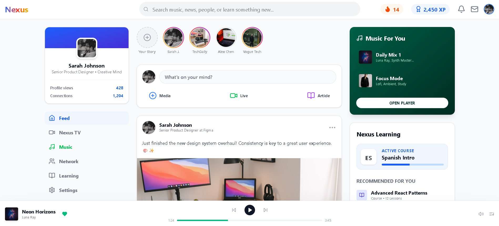

# Sigma App

🔗 **Live Demo**: [https://itsiamdev.github.io/sigmaapp/](https://itsiamdev.github.io/sigmaapp/)



A modern web application built with React, TypeScript, and Vite. This project uses shadcn/ui components for a clean, accessible, and customizable UI.

## Features

- ⚡ **Fast Development** - Built with Vite for lightning-fast development experience
- 🎨 **Modern UI** - Styled with Tailwind CSS and shadcn/ui components
- 🔧 **Type Safety** - Full TypeScript support throughout the codebase
- 📱 **Responsive Design** - Mobile-first approach with responsive components
- ♿ **Accessible** - Follows WAI-ARIA guidelines for accessibility

## Tech Stack

- **Framework**: React 18 with TypeScript
- **Build Tool**: Vite
- **Styling**: Tailwind CSS
- **UI Components**: shadcn/ui
- **Routing**: (Add your routing solution if applicable)

## Getting Started

### Prerequisites

- Node.js 18+ 
- npm or yarn or pnpm

### Installation

```bash
# Install dependencies
npm install

# Start development server
npm run dev

# Build for production
npm run build

# Preview production build
npm run preview
```

## Project Structure

```
sigmaapp/
├── src/
│   ├── components/
│   │   ├── ui/          # shadcn/ui components
│   │   └── figma/       # Figma-related components
│   ├── styles/          # Global styles
│   ├── App.tsx          # Main application component
│   └── main.tsx         # Application entry point
├── index.html
├── vite.config.ts
└── package.json
```

## Available Scripts

- `npm run dev` - Start development server
- `npm run build` - Build for production
- `npm run preview` - Preview production build
- `npm run lint` - Run ESLint

## License

This project is licensed under the MIT License - see the [LICENSE](LICENSE) file for details.

## Contributing

Contributions are welcome! Please feel free to submit a Pull Request.

## Acknowledgments

- [shadcn/ui](https://ui.shadcn.com/) for the beautiful UI components
- [Vite](https://vitejs.dev/) for the fast build tool
- [Tailwind CSS](https://tailwindcss.com/) for the utility-first CSS framework
